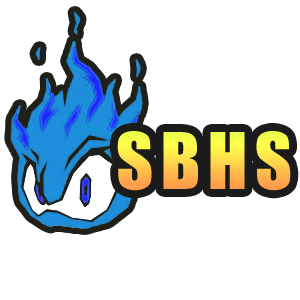

This is a repository for hacking Sonic Battle,
a game for the GameBoy Advanced released in 2004.

You can join our [Discord](https://discord.gg/JPE3FBM)
for information on updates.

## Documentation
All docs on Sonic Battle reverse engineering are in [**`DOCUMENTATION.md`**](DOCUMENTATION.md).

## Hack Suite
This hack suite is written in Java (because GUIs and portability).
It has tools to edit Palettes, Dialogue, Sprites, and more. Do note
that it is a WIP, and not all the features are implemented yet.

## Contributing
If you find any new research on SB, make an issue and we can discuss
expanding upon it or including it into the Hack Suite. Stand-alone
tools can also be placed in this repo, just submit a PR and make
sure your code is documented and pretty.
